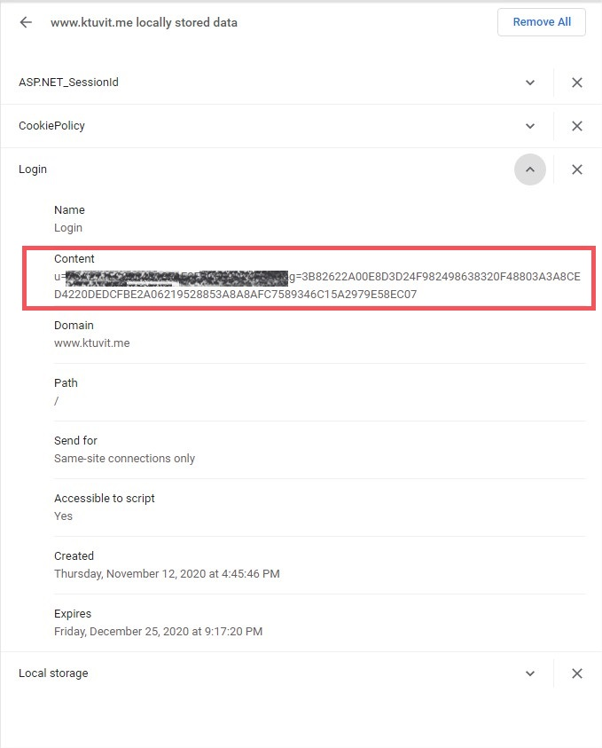

# API
Before using this API it's important you know how Ktuvit database works.
You can search and browse the site with no problem but downloading and get a subtitle list for a movie requires you to log in.
After logging in you can do all that a user can.

Each movie and series in Ktuvit has a unique ID which I refer to as Ktuvit ID or ktuvitId. I refer to the movie/series entry in ktuvit as "title" to be inclusive.
Each title in ktuvit has a list of subtitles each one with it's own id which I refer to as subId.

To get a title's list of subtitle we need it's Ktuvit ID and to download a subtitle file you need the title's Ktuvit ID and the subId of the file.
## Initialization
To initialize the manager you need the user's ['Login' cookie](chrome://settings/cookies/detail?site=www.ktuvit.me&search=cookie). 




```javascript
const ktuvitManager = require('ktuvit-api');

const loginCookie = "u=####g=####";
const manager = new ktuvitManager(loginCookie);
```
Atm there is no validation on the login cookie.
Also Future versions might add multiple users per manager.

You can use the manager's function getLoginCookie() if you don't have the cookie.

### `getLoginCookie(Email, hashedPassword)`
If you don't want to build a cookie jar you can use the manager's `getLoginCookie(Email, hashedPassword)`. 

Email - the user's email.

hashedPassword - the user's hashed password.

CaTzil has a [guide](https://github.com/XBMCil/service.subtitles.ktuvit/blob/master/README.md) how to get the hashed password for a user!


```javascript
const ktuvitManager = require('ktuvit-api');

const loginCookie = await ktuvitManager.getLoginCookie("email", "hashedPass");
const manager = new ktuvitManager(loginCookie);

//This works too
const manager = new ktuvitManager(await ktuvitManager.getLoginCookie("email", "hashedPass"));
```
## Ktuvit title ID
To get the subtitle list for a title or download a sub you must have the title's Ktuvit ID. There are few ways to get a title's ktuvit ID using the manager. let's start with the fastest.

### `getKtuvitID(item)`

The manager provides `getKtuvitID(item)` as a fast and simple way to get the Ktuvit ID back for a title. 

**important: You can only use this function if you have the title's Imdb ID**, just the title name is not enough.

The fastest way to use it is by providing the IMDB id of the title and the **title's name, the way Ktuvit stores it.**
```javascript
const pulpFictionKtuvitID = await manager.getKtuvitID({imdbId: 'tt0110912', name: 'Pulp Fiction'});

console.log(pulpFictionKtuvitID) //Prints: 34C337572B6C5626B9352ABCB3CCDA45
```

Since ktuvit is maintained by the community we sometimes get a mismatch between the title's actual spelling and the way it's spelled on Ktuvit.
You can still use the function with just the IMDB id of the title but note that this takes more time since it calls IMDb to get the title's name.

```javascript
const pulpFictionKtuvitID = await manager.getKtuvitID({imdbId: 'tt0110912'});

console.log(pulpFictionKtuvitID) //Prints: 34C337572B6C5626B9352ABCB3CCDA45
```

### `searchKtuvit(item)`
If you don't have the title's IMDb id you're just gonna have to search the title on Ktuvit and choose yourself. The search function accepts an `item` object:
```javascript
//item example
{
    name: "ספרות זולה",  //Title's name
    actors: ["69344"],  //Array of actors Ktuvit's id
    studios: null,  //Not usable yet. keep null.
    directors: ["15820"],  //Array of directors Ktuvit's id
    genres: ["9","16","22"], //Array of genres Ktuvit's id
    countries: ["14","13","223"],  //Array of countries Ktuvit's id
    languages: ["1","155","170"],  //Array of languages Ktuvit's id
    year: "2018",  //The title's release year in string. A range string is also accepted.
    rating: ["2","3","4"],  //Array of ratings from 0-9
    type: "movie",  //String movie|series
    withSubsOnly: false  //Boolean true|false
}
```
The item can be empty or contain only one of the values. As an advice you should avoid using anything besides name, type, year and withSubsOnly.
The function returns an array of results from Ktuvit. 
Example:

```javascript
const pulpFictionResults = await manager.searchKtuvit({name:'pulp fiction'});

//pulpFictionResults will look like:
[
  {
    ID: '34C337572B6C5626B9352ABCB3CCDA45',
    HebName: 'ספרות זולה',
    EngName: 'Pulp Fiction',
    IMDB_Link: 'http://www.imdb.com/title/tt0110912',
    ReleaseDate: 1994,
    FilmRunTimeMinutes: 154,
    Summary: '',
    FolderID: '52281b55-02e8-4684-bf54-95c715cc8348',
    CreateDate: '2017-10-03T03:00:05.567',
    Rating: 8.9,
    NumberOfVoters: 1490828,
    NumOfSubs: 64,
    FilmImage: null,
    UrlParam: null,
    Actors: "ברוס וויליס, אומה תורמן, סמואל ל. ג'קסון, ג'ון טרבולטה, לורנס בנדר, דוד ווסקו",
    Countries: null,
    Directors: 'קוונטין טרנטינו',
    Genres: 'דרמה, פשע',
    Languages: null,
    Studios: null,
    IsSeries: false,
    ImdbID: 'tt0110912'
  }
]
```
From here you can iterate through the array, find the title you want and extract the `ID` field and that's your Ktuvit ID.

## Ktuvit sub ID

If you have a title's ktuvitId you can fetch it's subtitles using these functions based on whether it's a movie or a series' episode respectively

### `getSubsIDsListMovie(ktuvitID)`
### `getSubsIDsListEpisode(ktuvitID, season, episode)`

Both these functions will return an array of `subtitle object`.

for example:

```javascript
const pulpFictionsSubtitles = await manager.getSubsIDsListMovie('34C337572B6C5626B9352ABCB3CCDA45');

const friendsFirstEpisodeSubs = await manager.getSubsIDsListMovie('7C1B6B0897EA6E819781158935199C8E', 1, 1);

console.log(pulpFictionsSubtitles) //Will print:

[
    {
        //Subtitle object example
        subName: 'Pulp.Fiction.1994.720p.BluRay.DTS.x264-ViGi',  //File name as a String.
        id: 'E100454053EDCCB2F625385144036836', //The sub's subId as a String.
        downloads: 553, //amount of times the sub was download as a Number.
        uploadDate: 2017-11-21T00:00:00.000Z,  //Date object for when the sub was uploaded.
        size: '154.39 KB',  //File size as a string.
        fileType: 'srt',  //Sub's file format as a String.
        credit: 'תרגום: אלמוני'  //The credit's section from Ktuvit website as a String.
    },
    ...
]
```
## Downloading subtitles
### `downloadSubtitle(KtuvitId, subId, callback)`
Now that you have both the `KtuvitId` and the `subId` you can download the subtitle file. The download function third argument is a callback function with `buffer` as it's first argument. 

usage examples:

```javascript
//Printing the srt
manager.downloadSubtitle('34C337572B6C5626B9352ABCB3CCDA45',
    'E100454053EDCCB2F625385144036836',
    function(buffer){ console.log(buffer)});

//Saving it locally
const fs = require('fs');

manager.downloadSubtitle('34C337572B6C5626B9352ABCB3CCDA45',
    'E100454053EDCCB2F625385144036836',
    function(buffer){ 
        fs.writeFile('pulp-fiction.srt', buffer, function (err) {
            if (err) return console.log(err);
            console.log('SRT is ready!');
            });
    });
```
## Everything else
The rest of the functions and enums in the manager are exposed and you can use them as you want. They are not documented because they are not part of the API.
